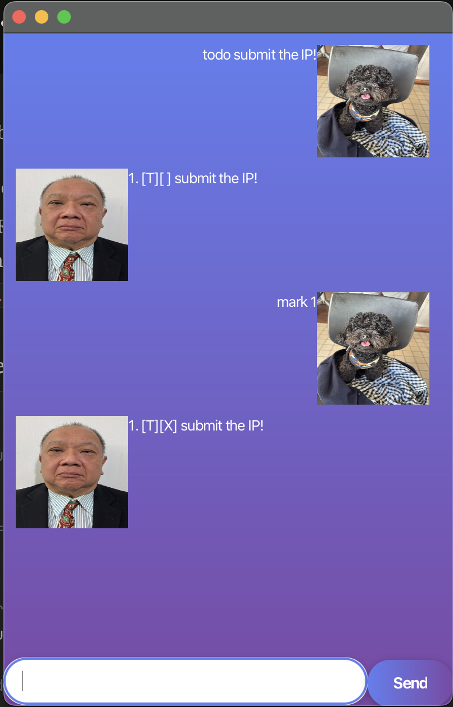

# TYRONE User Guide



TYRONE is a task management application that helps you organize your todos, deadlines, and events.

## Quick Start

1. Download the latest release from [GitHub](https://github.com/yishengt/ip/releases)
2. Ensure you have Java 17 installed
3. Double-click `tyrone.jar` to launch
4. Start managing your tasks!

## Features

### Adding a Todo Task
Add a simple task without any deadline.

**Format:** `todo DESCRIPTION`

**Example:** `todo read book`
```
Got it. I've added this task:
  [T][ ] read book
Now you have 1 task in the list.
```

### Adding a Deadline Task
Add a task with a specific deadline.

**Format:** `deadline DESCRIPTION /by DATE`

**Example:** `deadline submit assignment /by 2024-03-15`
```
Got it. I've added this task:
  [D][ ] submit assignment (by: Mar 15 2024)
Now you have 2 tasks in the list.
```

### Adding an Event Task
Add an event with a specific time.

**Format:** `event DESCRIPTION /at TIME`

**Example:** `event team meeting /at 2pm`
```
Got it. I've added this task:
  [E][ ] team meeting (at: 2pm)
Now you have 3 tasks in the list.
```

### Listing All Tasks
Display all your tasks.

**Format:** `list`

**Example:**
```
1. [T][ ] read book
2. [D][ ] submit assignment (by: Mar 15 2024)
3. [E][ ] team meeting (at: 2pm)
```

### Marking a Task as Done
Mark a task as completed.

**Format:** `mark INDEX`

**Example:** `mark 1`
```
Nice! I've marked this task as done:
  [T][X] read book
```

### Unmarking a Task
Mark a completed task as not done.

**Format:** `unmark INDEX`

**Example:** `unmark 1`
```
OK, I've marked this task as not done yet:
  [T][ ] read book
```

### Deleting a Task
Remove a task from your list.

**Format:** `delete INDEX`

**Example:** `delete 2`
```
Noted. I've removed this task:
  [D][ ] submit assignment (by: Mar 15 2024)
Now you have 2 tasks in the list.
```

### Finding Tasks
Search for tasks by keyword.

**Format:** `find KEYWORD`

**Example:** `find book`
```
Here are the matching tasks in your list:
1. [T][ ] read book
```

### Sorting Deadlines
Sort all deadline tasks by date (earliest first).

**Format:** `sort`
```
Tasks sorted by deadline!
```

### Exiting the Application
Close the application.

**Format:** `bye`

## Command Summary

| Command | Format | Example |
|---------|--------|---------|
| Add Todo | `todo DESCRIPTION` | `todo buy milk` |
| Add Deadline | `deadline DESC /by DATE` | `deadline homework /by 2024-03-20` |
| Add Event | `event DESC /at TIME` | `event party /at 7pm` |
| List Tasks | `list` | `list` |
| Mark Done | `mark INDEX` | `mark 1` |
| Unmark | `unmark INDEX` | `unmark 2` |
| Delete | `delete INDEX` | `delete 3` |
| Find | `find KEYWORD` | `find book` |
| Sort | `sort` | `sort` |
| Exit | `bye` | `bye` |

## Date Format
Deadlines use the format: `yyyy-MM-dd`

Examples:
- `2024-03-15` (March 15, 2024)
- `2024-12-31` (December 31, 2024)

## Data Storage
Your tasks are automatically saved to `data/tyrone.txt` after each command.

## FAQ

**Q: Where is my data saved?**  
A: Tasks are saved in `data/tyrone.txt` in the same folder as the application.

**Q: Can I edit the data file directly?**  
A: Yes, but be careful with the format to avoid data corruption.

**Q: The application won't start. What should I do?**  
A: Make sure you have Java 17 installed. Check by running `java -version` in terminal.

## Feedback
Have suggestions or found a bug? [Open an issue on GitHub](https://github.com/yishengt/ip/issues)!
